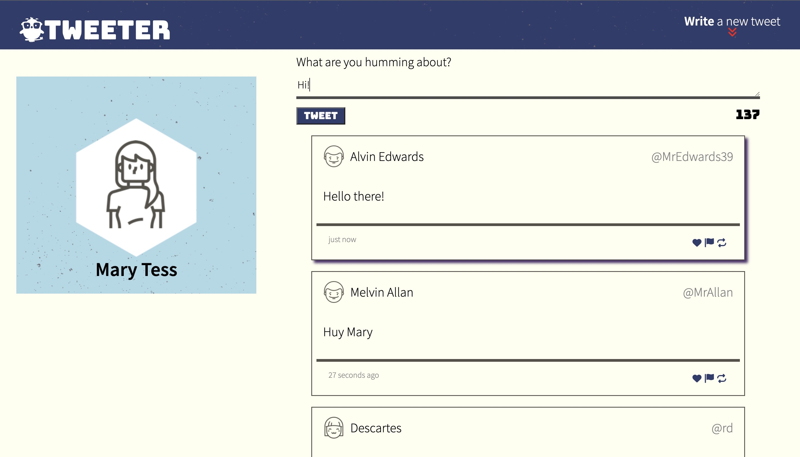
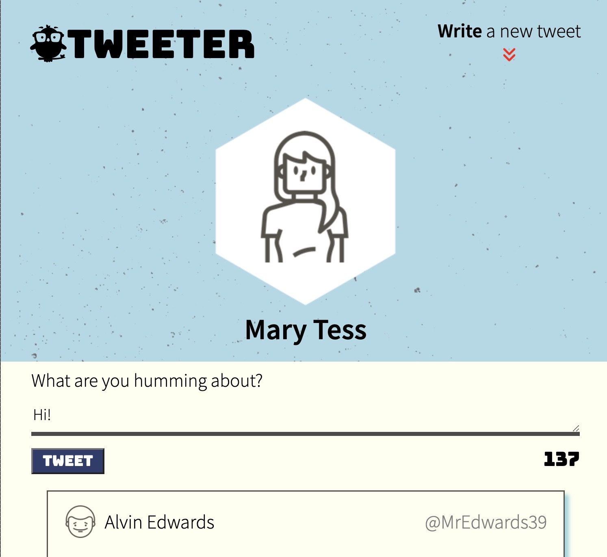
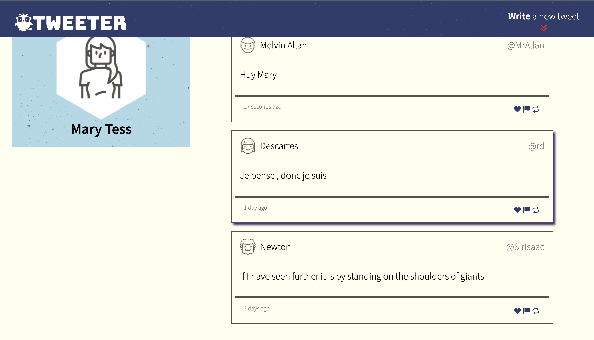
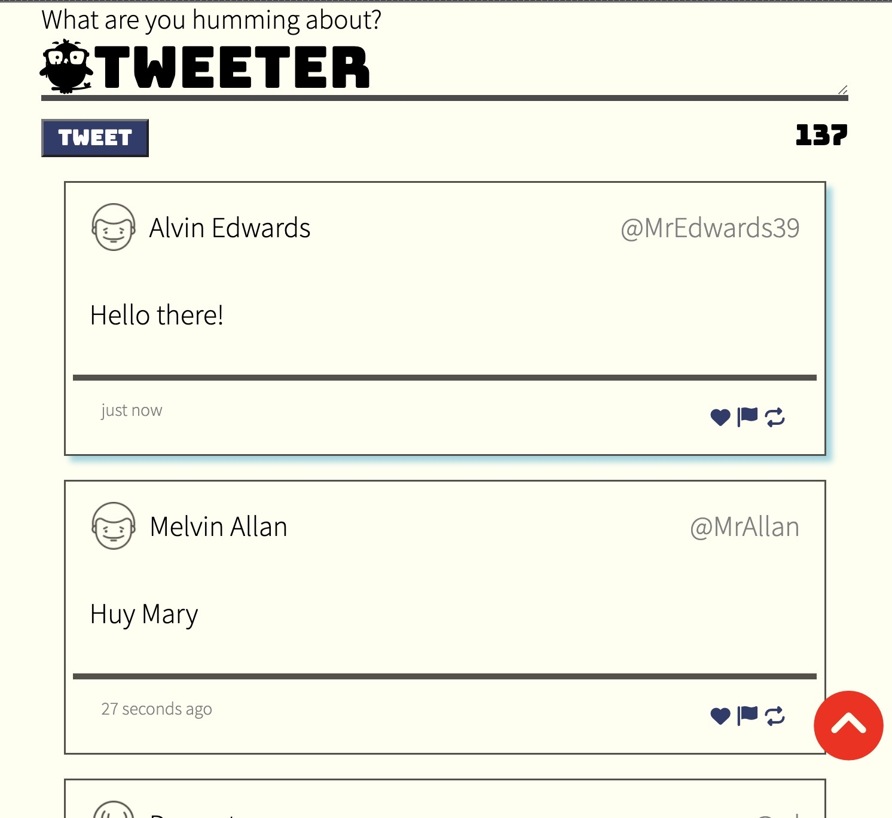

# Tweeter Project

**Tweeter** is a single-page *Twitter* clone.

## Getting Started

1. Install dependencies using the `npm install` command.
2. Start the web server using the `npm run local` command. The app will be served at <http://localhost:8080/>.
3. Go to <http://localhost:8080/> in your browser.

## Dependencies

- Express
- Node 5.10.x or above
- Chance
- md5

## Usage

Just type in your *'tweet'* and it will be displayed. A random name, handle, icon, and time ago posted will come with the tweet.

Rules are to be followed:
  - tweet should be within 140 characters.
  - tweet should exist.

Failure to do so, the tweet won't execute and a relevant error message will appear.

## Features

**Desktop:
  - The header is fixed and used to navigate to the top and focus on the 'tweet-line'

**Mobile:
  - Only the logo is fixed and a button will appear on the lower right part of the screen as the header button disappears. The new button will then be used to navigate to the top and focus on the 'tweet-line'
